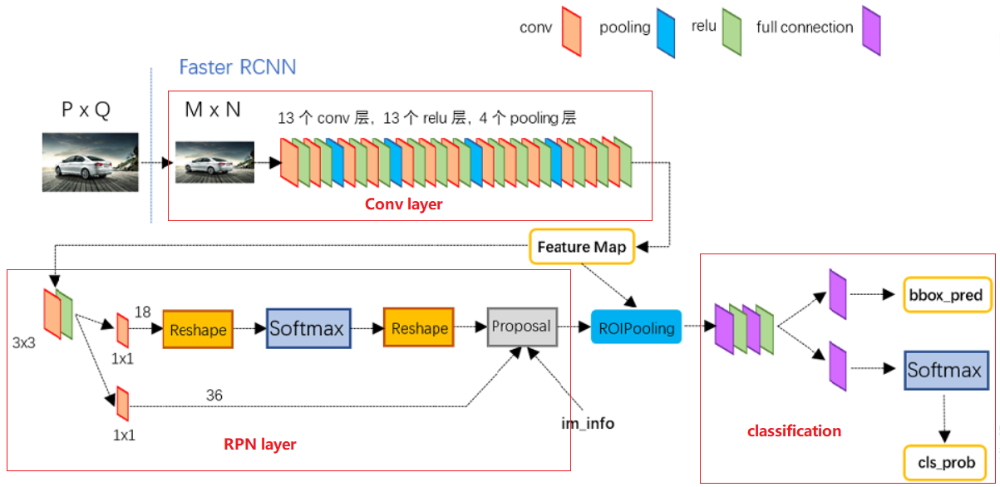
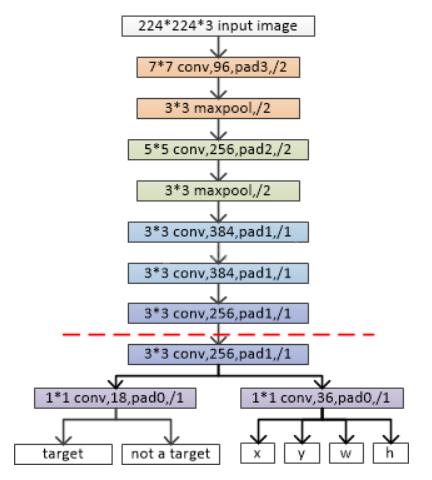
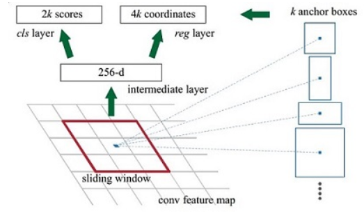
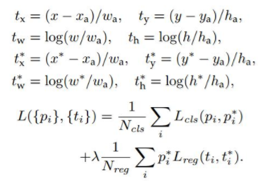

### Notes of studying Faster R-CNN
+ Basically, Faster R-CNN can be considered as the combination of these two major parts: **PRN layer** which is a fully-connected network used for generating region proposals with scores, and **Fast R-CNN** network for the sake of detection based on the proposals. Some layers of these two parts are shared to save training time, the number of shared number depends on the choice of CNN network.

+ More specifically, Faster R-CNN can be separated into 4 elements:
  1. The first one is _Conv layer_, which is used for generating feature maps (*features*(what) and *maps*(where)) that will be used for later proposal layer and Poi layer.
  1. The second one is _RPN layer_ used for outputting a set of rectangular object proposals. There are two tasks in this layer: determining whether the anchors are background or foreground ones by a two-class softmax; getting proposals of anchors via bounding box regression.
  1. _Roi layer_ is the third one. It has two inputs: the featurs maps from Conv layer, the proposals from the RPN layer. After Roi pooling, we have fixed-length proposal feature maps for classification.
  1. The last one is _classification layer_, it uses full connected layer and softmax to classify the proposals. Then, bounding box regression is used again for generating accurate rectangular BBox.

+ **Conv layers** can be different type of CNN by the choice of realisation. For example, it can be VGG16, resnet16,101,152, and mobile net in the project tf-faster-rcnn. As the layers above the red dashed in the picture below shows, the Conv layer has many convolutional layers, pooling layers and ReLu lyers (using ZF mode as example).  

+ **RPN layer**. The promotion of faster RCNN from fast RCNN is the RPN layer that is faster than SS. As descripted above, it has two streamlines. In the above picture, the layers below the dashed are PRN layer. The left part is the classification of archors, and the right one is to generate the position of size of archors.
  1. **Anchor**. The process of creating bounding box, one concept that plays a pivotal role is anchor. 
   In this picture, the *k* anchor boxes are created for each pixel of the picture which have various shapes and sizes (3 and 3 in paper). The number 256d is from the last convolutional layer (the example is from conv5 layer of ZF model), meaning 256 features. The cls layer has *2k* scores, each anchor has two (foreground and background). The reg layer has *4k* scores, X, Y, W, H, for each, which is used for the regression later on.
  2. **Proposal layer forward**. After the anchors are generated, they need to go through the bounding-box regression. Subsequently, they need to be sorted by foreground softmax score, and filter the top 6000 archors. After which, these archors are mapped to the original picture to find the ones that across the boundary. Then, do the nms (nonmaximum suppression) and sort the left foreground archors again by foreground softmax scores. At last, select the top 300 ones as the proposals.
  3. **Loss function**.   In the picture above, the *t* is the predicted bounding box of the foreground anchor with corresponding location (x,y) and size (w,h), *t*\* is the corresponding Ground-truth box; the *i* in the formula is anchor index; *pi* is the probability of foreground softmax predict, and *pi*\* is probability of ground-truth. If the IoU between the *i* anchor and ground-truth is bigger than 0.7, then regard this anchor a foreground one, so *pi*\* is 1; or if IoU < 0.3 then *pi*\* is 0; those anchors with 0.3<IoU<0.7 is discarded.  The whole loss function has two parts: *cls loss* and *reg loss*.
    - *cls loss* is used to train the network of classifying foreground and background anchors.
    - *reg loss* in used to train the bounding box regression
  4. **Training process**.
     -  train the RPN network with the pre-trained model.
     -  train the Fast RCNN network with the proposals from last step.
     -  use Fast RCNN to initialise the mutual convolutional layers.
     -  repeat the step 1,2,3 till the end.
