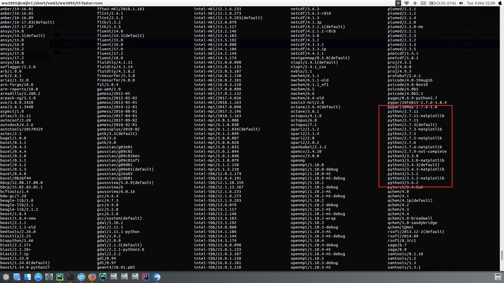
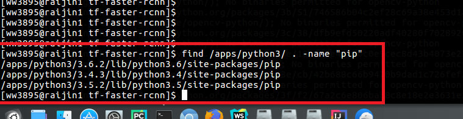

####My work of this week:
1. I tried to install the project tf-faster-rcnn on the server NCI, but it turns out that this project is not able to run on it due to the constrain of that server. the specific reason is as following:
- In the process of setup, opencv is required. But when I installed it, it was reported at there is no match version of opencv for the python in the server (the version I used was Python 3.5.2).
  
- So I check the available versions of Python3 on the server, they are 3.3.0, 3.4.3, 3.5.2 and 3.6.2. In these versions, only 3.3.0 is supported by opencv. 
  
- Therefore, I tried it. But unfortunately, there is no pip for Python3.3.0 on the NCI server. 3.3.0 is the only version not having pip! which means OpenCV cannot be installed as well.
  
  
2. I also tried to run that project without CUDA and nvcc on my laptop, but failed. The CUDA is critical in running this project, since it needs to compile "nms".

2. Then I tried the computers in ANU labs, also failed, as there is no CUDA in them.
  
2. I set up the git environment of GitHub for projects and weekly report.

3. I studied the source code of the project tf-faster-rcnn.
